# Expense Audit Risk Dashboard with Natural Language Querying

Internal audit expense risk dashboard built with PostgreSQL, Power BI, Streamlit, and Gemini-powered natural language querying.

## Tools


## Project Summary

This project is a portfolio-grade analytics system designed to simulate how an internal audit or finance monitoring team can track suspicious, policy-relevant, or operationally risky expense behavior. The system combines a structured BI reporting layer with a natural-language query interface so users can both monitor fixed audit views and ask ad hoc business questions on top of the same PostgreSQL-backed data.

The project was built as an end-to-end analytics workflow covering:
- synthetic data generation in Python
- PostgreSQL database design and reusable SQL views
- Power BI dashboard development
- Streamlit app development
- Gemini API integration for natural-language-to-SQL querying
- repository packaging and deployment preparation

## Business Problem

Traditional expense dashboards are useful for fixed monitoring, but they often fail when a user wants to ask a new question that was not prebuilt into the dashboard. On the other hand, raw database querying is too technical for most business users. This project bridges that gap by combining:

- **Power BI** for fixed and structured dashboard reporting
- **Streamlit** for interactive exploration and app-based usage
- **Gemini API** for natural-language-to-SQL query generation
- **PostgreSQL** as the shared backend and analytics source

The result is a system where a user can:
- monitor risky employees and suspicious expense behavior
- review weekend spending patterns
- inspect vendor concentration and top-spend entities
- ask business questions in natural language and get SQL-backed answers

## End-to-End Workflow

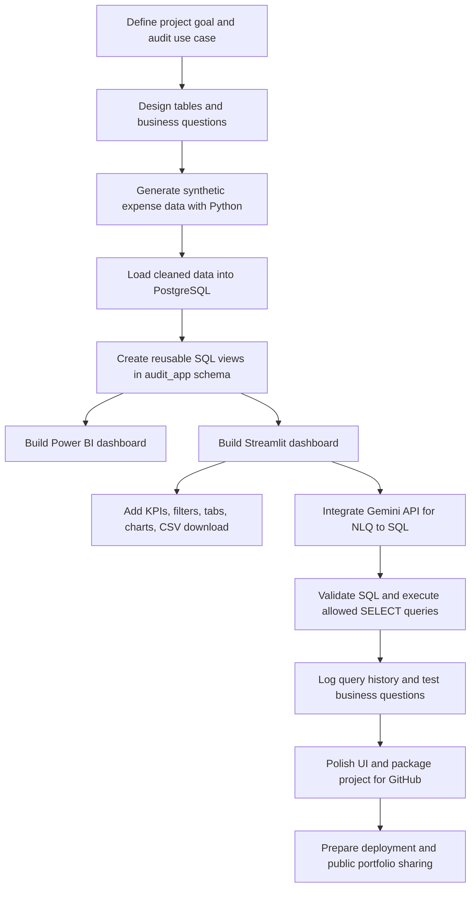

## System Architecture

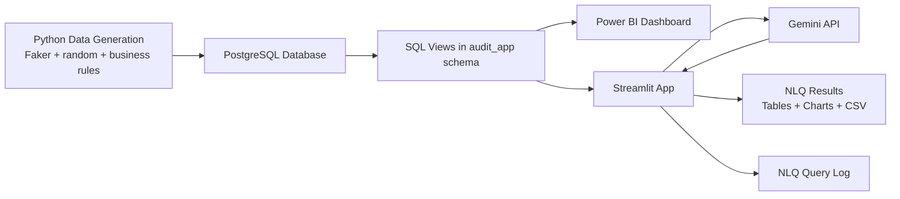

## Project Build Phases

### 1. Project Planning

The project started with the decision to build an internal audit and expense risk monitoring system rather than a generic dashboard. The goal was to make the project strong enough for a portfolio by combining database design, analytics reporting, app development, and AI-assisted querying in one system.

### 2. Synthetic Data Generation

The dataset was generated in Python using libraries such as Faker and random-based business rules to simulate realistic organizational expense behavior. This step made it possible to create employees, vendors, categories, expense transactions, and intentionally risky or policy-sensitive patterns that would be useful for audit analysis.

Examples of simulated behavior included:
- weekend expenses
- high-value transactions
- risky employees
- vendor concentration
- travel-related and policy-relevant spend patterns

### 3. PostgreSQL Database Layer

The generated data was loaded into PostgreSQL, which acts as the main backend for both the Power BI dashboard and the Streamlit application. PostgreSQL was chosen because it is closer to real analytics workflows than a flat-file or notebook-only setup.

### 4. SQL Analytics Layer

Reusable SQL views were created inside the `audit_app` schema so that the reporting and application layers could rely on the same business logic. These views support KPIs, risk summaries, weekend expense review, and downstream natural-language querying.

### 5. Power BI Dashboard

Power BI was used as the fixed reporting layer. This part of the project is meant for users who want a structured dashboard experience with predefined charts and drilldowns.

### 6. Streamlit Application

The Streamlit app was built as the interactive front-end. It includes:
- KPI summary cards
- tabs for different audit views
- filters for risk, vendor, employee, and date
- data tables and Plotly charts
- CSV download options
- Power BI report access
- natural language querying interface

### 7. Gemini Natural Language Querying

Gemini API was integrated so users can ask questions in plain English. The model converts the question into SQL, the SQL is validated for safety, and allowed queries are executed against PostgreSQL.

This part of the project includes:
- schema-aware prompting
- SQL validation to allow only safe SELECT queries
- restricted access to approved views
- result display inside the Streamlit app
- NLQ query history logging

### 8. UI and Usability Refinement

The Streamlit interface was refined with a darker visual theme, selective gradient styling, cleaner naming, and better organization of the dashboard sections. The goal was not to overdesign the app, but to make it polished and credible enough for a portfolio.

### 9. Documentation and Deployment Preparation

The final stage includes structuring the repository properly, drafting a detailed README, organizing screenshots, preparing deployment settings, and making the project easy for recruiters or reviewers to understand.

## Tech Stack

| Layer | Tools Used |
|------|------------|
| Data generation | Python, Faker, random |
| Database | PostgreSQL |
| SQL analytics layer | PostgreSQL views |
| BI dashboard | Power BI |
| App interface | Streamlit |
| Data handling | pandas |
| Visualization | Plotly |
| Natural language querying | Gemini API |
| Versioning / sharing | GitHub |

## Core Features

- Expense KPI summary cards
- Risk overview reporting
- Weekend expense review
- Top weekend spend analysis
- Weekend expense trend chart
- Top weekend vendors chart
- Power BI dashboard integration
- Gemini-powered natural language querying
- Safe SQL validation before execution
- NLQ query history logging
- CSV download support

## Folder Structure

```text
expense-audit-risk-dashboard/
├── app/
│   ├── app.py
│   ├── audit_app_schema.csv
│   ├── nlq_query_log.csv
│   ├── nlq_test_sheet.csv
│   ├── requirements.txt
│   ├── .streamlit/
│   └── pages/
├── data/
├── images/
├── notebooks/
├── powerbi/
├── .gitignore
└── run_app.bat
```
## Visual Walkthrough

### 1. Hero

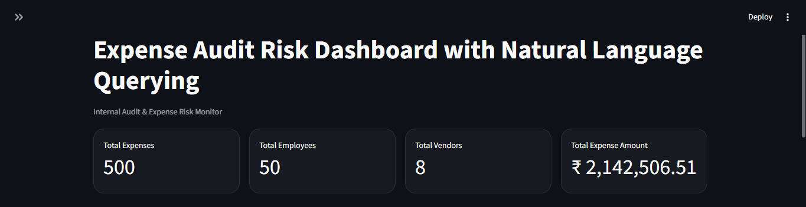

### 2. Natural Language Querying

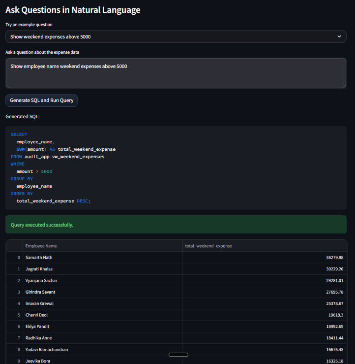

### 3. Risk Overview

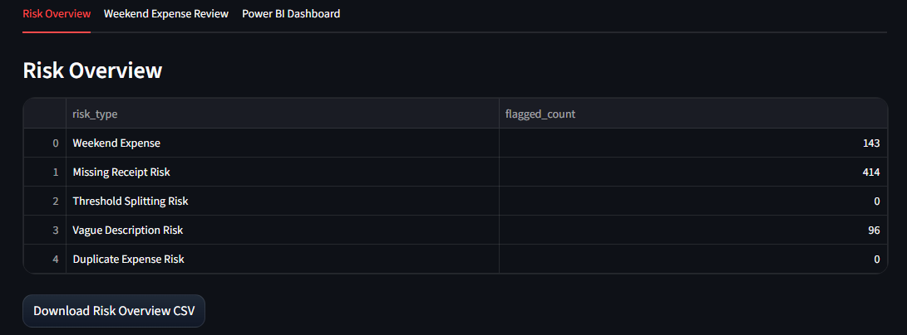

### 4. Weekend Expense Review

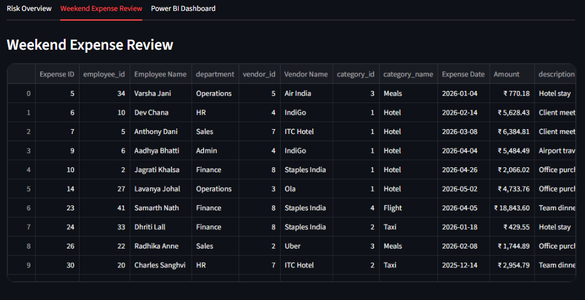

### 5. Top Weekend Spend

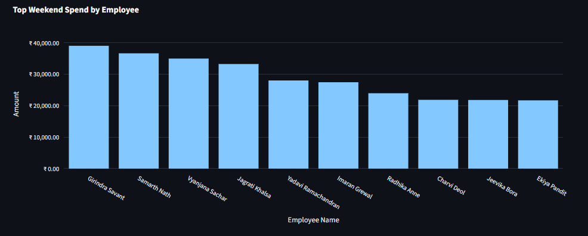

### 6. Weekend Expense Trend

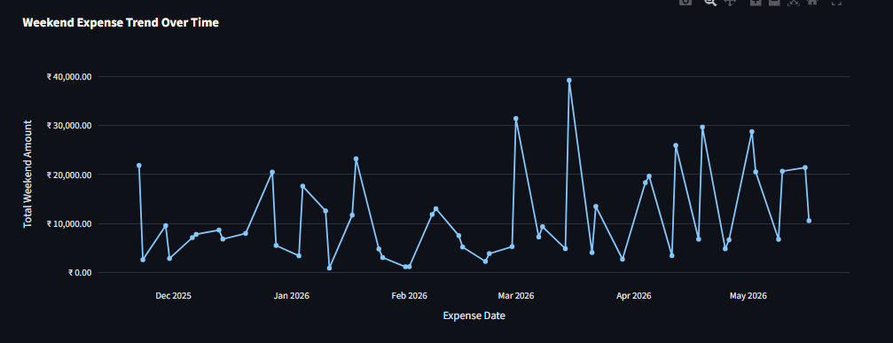

### 7. Top Weekend Vendors

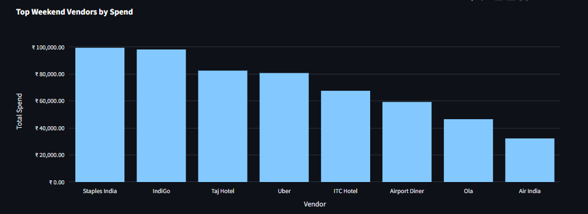

### 8. Power BI Dashboard Views

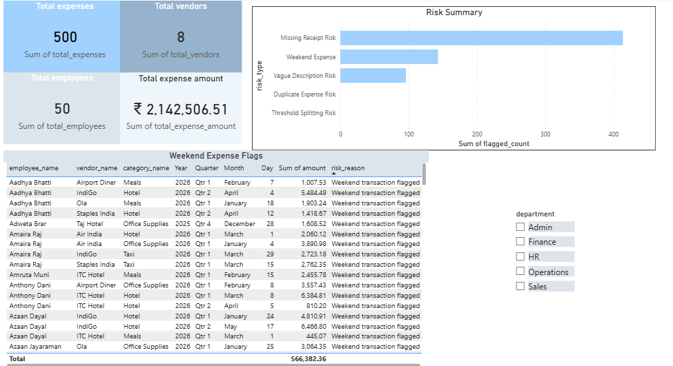

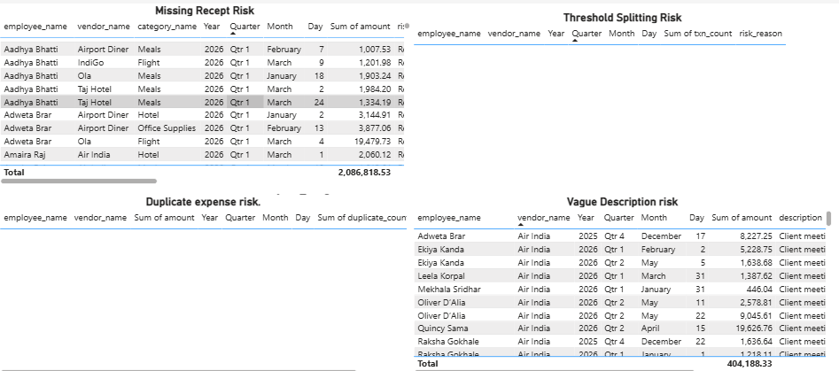

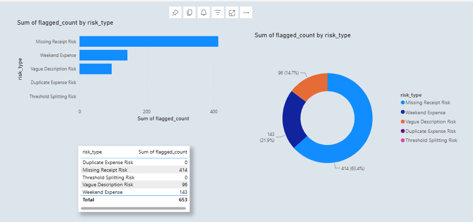

### 9. PostgreSQL / pgAdmin Backend Layer

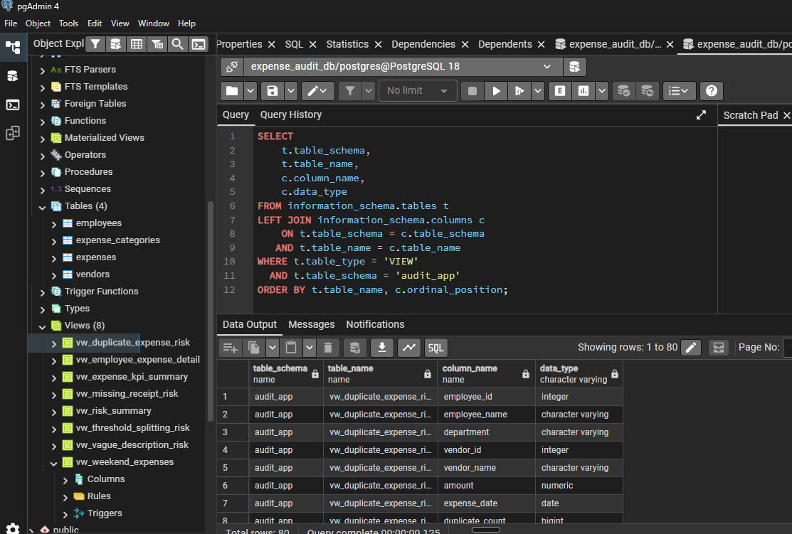
```

## How the Components Connect

1. Synthetic expense data is created in Python.
2. The data is loaded into PostgreSQL.
3. SQL views in the `audit_app` schema create reusable business logic.
4. Power BI reads from these PostgreSQL views for fixed reporting.
5. Streamlit also reads from PostgreSQL to power the interactive app.
6. Gemini receives the user’s question, generates SQL, and returns a query.
7. The app validates the SQL before executing it.
8. Results are shown as dataframes, charts, and downloadable outputs.

## Example Business Questions

- Which employees have unusually high weekend expenses?
- Which vendors account for the highest share of weekend spend?
- How many employees spent above a certain threshold on travel-related expenses?
- What is the total amount by risk level?
- Which suspicious or high-risk expense patterns appear most frequently?

## How to Run Locally

1. Clone the repository.
2. Move into the project folder.
3. Install dependencies:

```bash
pip install -r app/requirements.txt
```

4. Add Streamlit secrets.
5. Run the application:

```bash
streamlit run app/app.py
```

6. Or use the batch file from the root directory on Windows.

## Secrets Required

Create a Streamlit secrets file with the following:

```toml
GEMINI_API_KEY = "your_api_key"
POWER_BI_REPORT_URL = "your_power_bi_url"

[connections.postgresql]
dialect = "postgresql"
host = "your_host"
port = 5432
database = "your_database"
username = "your_username"
password = "your_password"
```

## Deployment Plan

For public portfolio sharing, the intended deployment flow is:

1. Push the cleaned repository to GitHub.
2. Deploy the Streamlit app using Streamlit Community Cloud.
3. Add secrets in the deployment settings instead of committing them.
4. Connect the deployed app to a remote PostgreSQL database.
5. Add the live app link to this README and to resume / LinkedIn project sections.

### Live App

Add your deployed app link here:

Live app: [Open the live Streamlit app](https://expense-audit-risk-dashboard.streamlit.app/)

## Current Limitations

- Natural-language querying depends heavily on prompt quality and schema/value mapping.
- Gemini free-tier quota limits can interrupt query generation.
- Public deployment requires a remote PostgreSQL database, not a local machine database.
- Power BI public embedding depends on workspace settings and admin permissions.

## Future Improvements

- stronger semantic mapping for expense categories and business terms
- better NLQ fallback handling for quota and empty-result scenarios
- richer SQL validation and error explanation
- more audit-specific SQL views
- production-style deployment with managed cloud database

## Why This Project Matters

This project was designed to show more than dashboard creation. It demonstrates the ability to connect data engineering, SQL analytics, BI reporting, application development, and AI-assisted querying into one coherent workflow. That makes it a stronger portfolio project than a standalone Power BI dashboard or a notebook-only analysis.

## Author

Aditya

Portfolio project focused on analytics engineering, BI reporting, Streamlit applications, and AI-assisted data workflows.
